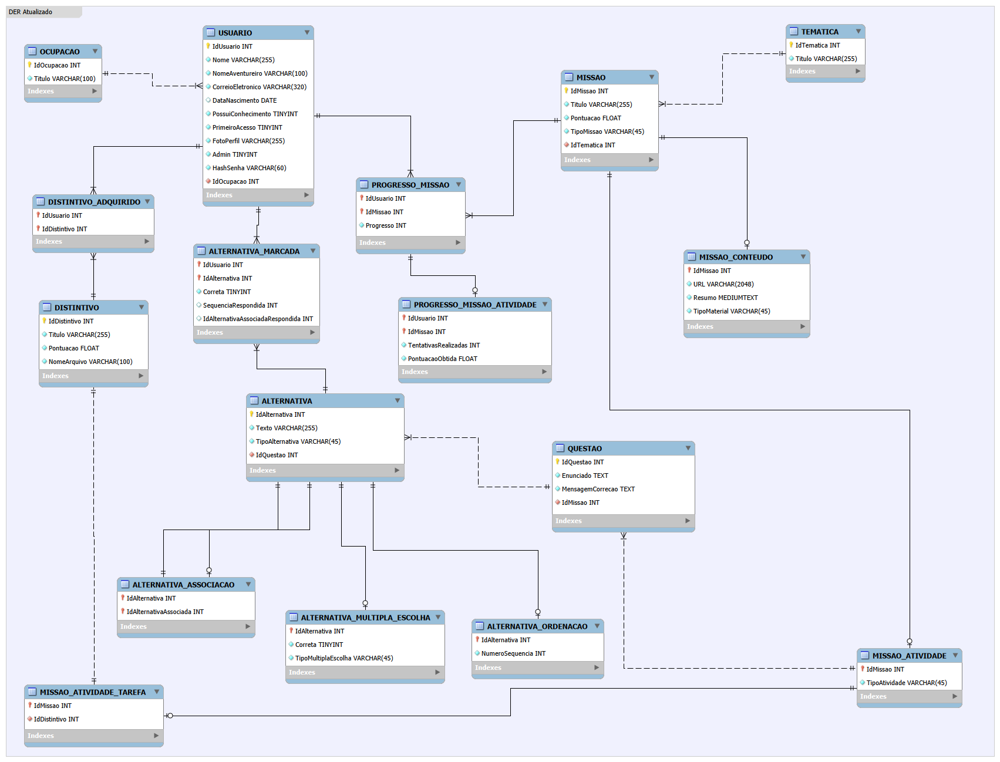

# Trilha Formativa de Inovação — API

<p align="center">

API responsável pelo fornecimento, gerenciamento e persistência dos dados da plataforma **Trilha Formativa de Inovação**, disponibilizando os serviços necessários para o funcionamento da aplicação frontend.

</p>

---

## Tecnologias utilizadas

Este projeto foi desenvolvido utilizando:

* **PHP 8**
* **Composer**
* **MySQL**
* **JWT (JSON Web Token)**
* **API RESTful**
* **PDO**

---

## Pré-requisitos

Antes de iniciar, é necessário possuir as seguintes ferramentas instaladas:

* **PHP 8**
* **Composer**
* **MySQL**

Para verificar se estão instalados corretamente:

```bash
php -v
composer -V
mysql --version
```

> **Observação:** caso esteja utilizando o XAMPP, o PHP e o MySQL já são disponibilizados pelo pacote. Nesse caso, é necessário apenas verificar se as versões e configurações utilizadas pelo projeto estão corretas.

---

## Instalação

### Clone o repositório

```bash
git clone https://github.com/AdulerV/trilha-formativa-inovacao-api.git
```

### Acesse a pasta do projeto

```bash
cd trilha-formativa-inovacao-api
```

### Dependências

O projeto já disponibiliza no repositório os arquivos `composer.json` e `composer.lock`, responsáveis pelo gerenciamento e registro das dependências utilizadas pela API.

A pasta `vendor/`, contendo as dependências instaladas pelo Composer, também é disponibilizada no projeto.

Dessa forma, **não é necessário executar `composer install` para uma configuração inicial da aplicação**.

Caso seja necessário reinstalar ou atualizar as dependências, o Composer pode ser utilizado através do comando:

```bash
composer install
```

> **Observação:** o `composer.json` e o `composer.lock` devem ser mantidos no repositório para registrar as dependências e suas respectivas versões.

---

## Configuração do ambiente

A API utiliza um arquivo `.env` para armazenar as configurações específicas do ambiente de execução.

Crie um arquivo `.env` na raiz do projeto:

```text
.env
```

Entre as configurações utilizadas pela aplicação estão:

* Chave utilizada para autenticação JWT;
* Tempo de expiração dos tokens;
* Outras configurações específicas do ambiente.

Exemplo de estrutura:

```env
JWT_SECRET=sua_chave_secreta
JWT_EXPIRATION=28800
```

Os valores devem ser configurados de acordo com o ambiente em que a API será executada.

> **Importante:** o arquivo `.env` pode conter informações sensíveis e **não deve ser versionado no repositório**. Utilize um arquivo `.env.example`, caso disponibilizado pelo projeto, como referência para a configuração do ambiente.

---

## Conexão com o banco de dados

A conexão da API com o banco de dados é realizada através da classe `Conexao`, utilizando a extensão **PDO (PHP Data Objects)**.

A aplicação está configurada para utilizar um servidor **MySQL** executado localmente, através do endereço `127.0.0.1` e da porta `3307`, utilizando o banco de dados `mydb`.

A configuração atual da conexão utiliza:

```text
Host:     127.0.0.1
Porta:    3307
Banco:    mydb
Usuário:  root
Senha:    vazia
Charset:  utf8mb4
```

A conexão é obtida através do método:

```php
Conexao::getConexao();
```

O PDO está configurado com `PDO::ERRMODE_EXCEPTION`, fazendo com que erros ocorridos durante a conexão ou execução de operações no banco de dados sejam tratados através de exceções.

> **Observação:** as configurações de conexão apresentadas correspondem ao ambiente de desenvolvimento local. Em ambientes de produção, recomenda-se utilizar variáveis de ambiente para armazenar as credenciais e demais configurações sensíveis do banco de dados.

---

## CORS e CorsMiddleware

A API possui um `CorsMiddleware` responsável por configurar o **CORS (Cross-Origin Resource Sharing)**, permitindo que o frontend realize requisições para a API quando as aplicações estão sendo executadas em origens diferentes.

Durante o desenvolvimento, o frontend utiliza o servidor do **Vite**, normalmente disponível em:

```text
http://localhost:5173
```

Como a API é executada separadamente, o navegador considera as aplicações como origens diferentes. Por isso, o middleware adiciona os cabeçalhos necessários para permitir a comunicação entre elas.

Atualmente, são permitidas requisições provenientes de:

```text
http://localhost:5173
```

Os seguintes métodos HTTP são permitidos:

```text
GET
POST
PUT
DELETE
OPTIONS
```

Também são permitidos os seguintes cabeçalhos:

```text
Content-Type
Authorization
X-Requested-With
```

O middleware trata ainda as requisições `OPTIONS`, utilizadas pelo navegador em determinadas requisições como parte do processo de **preflight** do CORS. Nesse caso, a API retorna o status HTTP `200` e encerra a requisição.

### Necessidade do CorsMiddleware

O middleware é necessário quando o frontend e a API estão hospedados em **origens diferentes**. Por exemplo:

```text
Frontend → http://localhost:5173
API      → http://localhost:8000
```

Nesse cenário, o navegador aplica as políticas de CORS e a API precisa informar explicitamente quais origens, métodos e cabeçalhos são permitidos.

Caso o frontend e a API sejam disponibilizados pela **mesma origem**, o CORS deixa de ser necessário para essa comunicação.

> **Observação:** o `CorsMiddleware` é especialmente relevante para o ambiente atual de desenvolvimento, no qual o frontend e a API são executados separadamente. Em produção, sua necessidade dependerá da forma como as duas aplicações serão hospedadas.

---

## Banco de dados

A API utiliza **MySQL** para armazenamento e gerenciamento dos dados da plataforma.

Antes de executar a aplicação, é necessário criar o banco de dados e executar o script SQL disponibilizado no projeto.

### Script do banco de dados

O script SQL contém:

* Criação do banco de dados;
* Criação das tabelas;
* Chaves primárias;
* Chaves estrangeiras;
* Restrições de integridade;
* Dados iniciais necessários para a aplicação.

O arquivo está localizado em:

```text
src/config/sql/database.sql
```

O script pode ser executado utilizando o **MySQL**, **phpMyAdmin** ou outra ferramenta compatível.

Caso esteja utilizando o XAMPP, o arquivo pode ser acessado através do caminho:

```text
C:\xampp\htdocs\trilha-formativa-inovacao-api\src\config\sql\database.sql
```

> **Importante:** o servidor MySQL deve estar em execução e configurado de acordo com as informações utilizadas pela classe `Conexao` antes de iniciar a API.

---

## Modelo de dados

O banco de dados da plataforma é composto pelas entidades responsáveis pelo gerenciamento dos usuários, missões, questões, alternativas, progresso, distintivos e demais informações utilizadas pela aplicação.

O modelo de dados completo pode ser visualizado abaixo:



---

## Executando a API

Após configurar o arquivo `.env` e preparar o banco de dados, a API pode ser executada localmente.

Para atualizar o autoload das classes:

```bash
composer dump-autoload -o
```

Em seguida, inicie o servidor embutido do PHP:

```bash
php -S localhost:8000 -t public
```

A API estará disponível em:

```text
http://localhost:8000
```

> **Observação:** a porta pode ser alterada de acordo com a configuração utilizada no ambiente de desenvolvimento.

---

## Autenticação

A API utiliza **JWT (JSON Web Token)** para autenticação e autorização dos usuários.

Após realizar a autenticação, o token deverá ser enviado nas requisições que exigem acesso autenticado.

O formato esperado é:

```http
Authorization: Bearer <TOKEN>
```

A chave utilizada para geração e validação dos tokens é definida através da variável `JWT_SECRET` no arquivo `.env`.

O tempo de validade do token é definido através da variável:

```env
JWT_EXPIRATION=28800
```

---

## Estrutura do projeto

A API está organizada em diferentes camadas, buscando separar as responsabilidades relacionadas à configuração, comunicação HTTP, regras de negócio, persistência de dados, segurança e tratamento de exceções.

```text
trilha-formativa-inovacao-api/
├── src/
│   ├── config/                    → Configurações da aplicação
│   │   ├── http/                  → Configurações relacionadas ao HTTP
│   │   ├── router/                → Configuração do roteamento
│   │   ├── routes/                → Definição das rotas da API
│   │   ├── sql/                   → Scripts relacionados ao banco de dados
│   │   ├── Conexao.php            → Gerenciamento da conexão com o banco
│   │   └── CorsMiddleware.php     → Configuração do CORS
│   │
│   ├── controller/                → Controle das requisições HTTP
│   ├── dao/                       → Acesso e persistência dos dados
│   ├── dto/                       → Objetos de transferência de dados
│   ├── exception/                 → Exceções personalizadas
│   ├── model/                     → Modelos e entidades do sistema
│   ├── security/                  → Autenticação e recursos de segurança
│   └── service/                   → Regras e lógica de negócio
│
├── vendor/                        → Dependências gerenciadas pelo Composer
├── .env                           → Configurações específicas do ambiente
├── .gitignore                     → Arquivos ignorados pelo Git
├── composer.json                  → Dependências e configurações do Composer
├── composer.lock                  → Versões específicas das dependências
├── database.sqlite                → Banco de dados SQLite
├── phpunit.xml                    → Configuração dos testes automatizados
└── README.md                      → Documentação do projeto
```

### Principais diretórios

| Diretório     | Responsabilidade                                                                                  |
| ------------- | ------------------------------------------------------------------------------------------------- |
| `config/`     | Centraliza configurações e componentes relacionados à infraestrutura da API.                      |
| `controller/` | Recebe e processa as requisições HTTP, encaminhando as operações para as camadas apropriadas.     |
| `dao/`        | Responsável pelo acesso e persistência dos dados no banco de dados.                               |
| `dto/`        | Define objetos utilizados para transferência e organização dos dados entre as diferentes camadas. |
| `exception/`  | Contém as exceções personalizadas utilizadas pela aplicação.                                      |
| `model/`      | Representa as entidades e estruturas de dados utilizadas pelo sistema.                            |
| `security/`   | Concentra os recursos relacionados à autenticação e segurança da API.                             |
| `service/`    | Contém as regras de negócio e a lógica da aplicação.                                              |

---

## Testes

O projeto utiliza **PHPUnit** para a execução dos testes automatizados.

As configurações do framework de testes estão definidas no arquivo:

```text
phpunit.xml
```

Os testes podem ser executados através do Composer/PHPUnit conforme a configuração disponibilizada no projeto.

---

## Integração com o Frontend

A API fornece os serviços utilizados pelo frontend da plataforma **Trilha Formativa de Inovação**.

A comunicação entre as aplicações ocorre através de requisições HTTP para os endpoints disponibilizados pela API.

Durante o desenvolvimento, o frontend e a API podem ser executados separadamente:

```text
Frontend → http://localhost:5173
API      → http://localhost:8000
```

Nesse cenário, o `CorsMiddleware` permite que o frontend realize as requisições necessárias à API.

Para utilizar a plataforma completa, é necessário que a API esteja configurada e em execução juntamente com o frontend.

---

## Repositórios

### Frontend

<LINK_DO_FRONTEND>

### Backend / API

https://github.com/AdulerV/trilha-formativa-inovacao-api

---

## Resumo da configuração

Para executar o projeto em uma nova máquina:

1. Instale **PHP 8**, **Composer** e **MySQL**;
2. Clone o repositório;
3. Acesse a pasta do projeto;
4. Configure o arquivo `.env`;
5. Inicie o servidor MySQL;
6. Execute o script `database.sql`;
7. Atualize o autoload com `composer dump-autoload -o`;
8. Execute a API com `php -S localhost:8000 -t public`;
9. Execute o frontend em `http://localhost:5173`.

---

<p align="center">

**Desenvolvido para a plataforma Trilha Formativa de Inovação 🎓💡**

</p>
